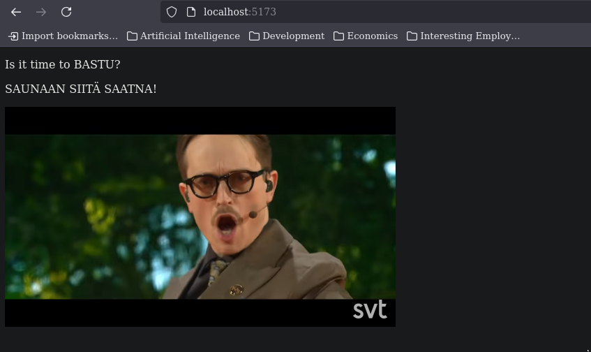
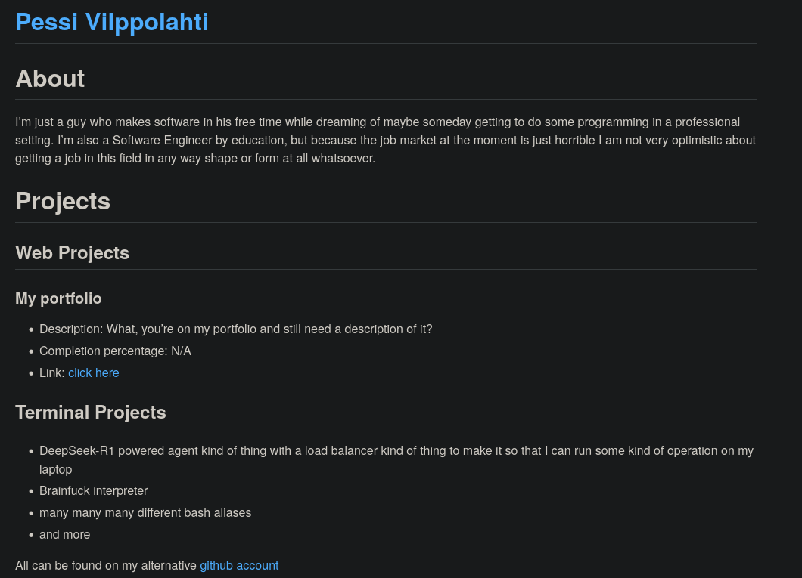
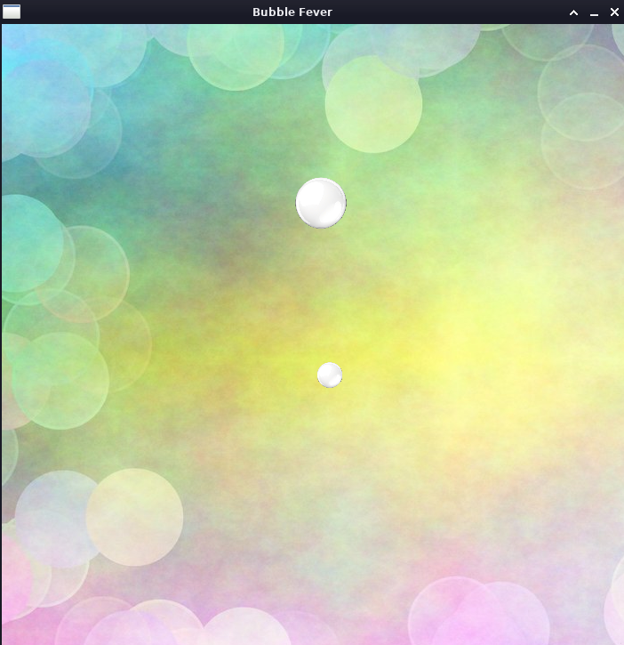
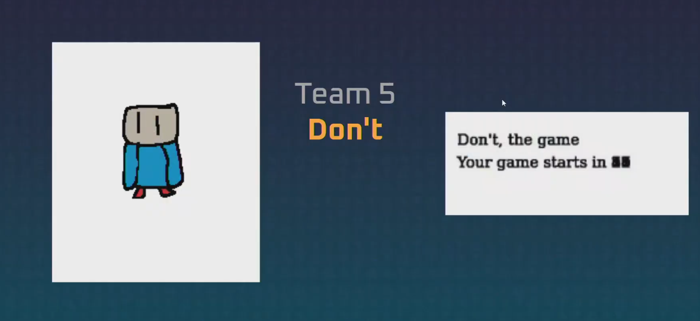
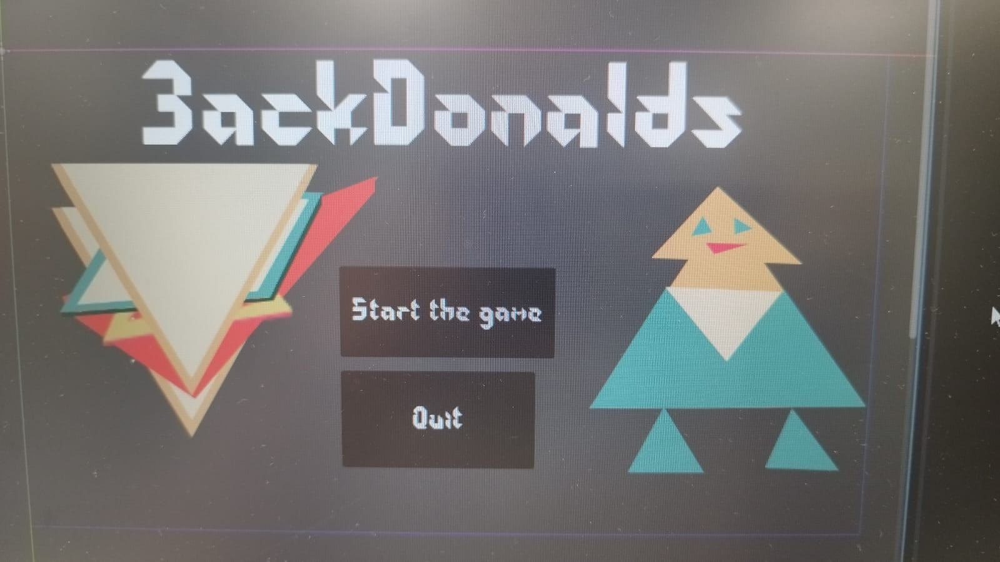
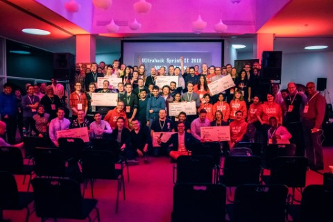
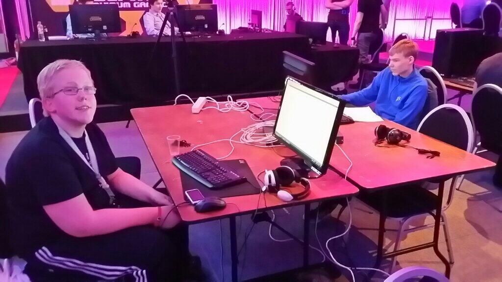

# Projects

## Web Projects

### Bastu Aika React Component

- Description: A component that plays that song from KAJ if it is infact thursday
- Tech used: React
- Completion percentage: 100
- Link: TBA
- Git repo: <a href="https://github.com/pessiv/bastu-aika-react-component">click here</a>
- Future improvements: Make fancy

### My Portfolio

- Description: What, you're on my portfolio and still need a description of it?
- Tech used: Github Pages and Markdown with HTML snippets
- Completion percentage: N/A
- Link: <a href="https://pessiv.github.io">click here</a>
- Git repo: <a href="https://github.com/pessiv/pessiv.github.io">click here</a>

## Terminal Projects

- DeepSeek-R1 powered agent kind of thing with a load balancer kind of thing to make it so that I can run some kind of operation on my laptop
- Brainfuck interpreter
- many many many different bash aliases
- and more

All can be found on my alternative <a href="https://github.com/vohvelikissa">github account</a>

## Jams That I have Attended

### Finnish Game Jam 2025

At first I tried to make something with AI, but ended up making things myself with Lua.

### ASM Game Jam 24

This was also my first ever time in the bigger Assembly Summer event so you know I had fun.

My game was left in a very unfinished state because it was just that exciting to be in Assembly Summers for the first time ever.

### Pride Game Jam Helsinki 24

This was the very first year I did Pride anything.

### Game Dev Club Jam 24

I forgor the real name for this one :/

### ULTRAHACK 2018 Sprint 2 Hack the Index

I got to meet some amazing people here. I hope all the best for all of them.

### Finnish Game Jam 2016

I had fun. I even included a demo video down below.

<iframe width="400" height="400" src="https://www.youtube.com/embed/keNmhdiXWnw?si=tR7cZpdD4f_kN3G1" title="YouTube video player" frameborder="0" allow="accelerometer; autoplay; clipboard-write; encrypted-media; gyroscope; picture-in-picture; web-share" referrerpolicy="strict-origin-when-cross-origin" allowfullscreen></iframe>

### GadgetJam

I just mostly had fun with this one jam.

Most of my Jam content is scattered around the interwebs and is thus hard to find. I am willing to make an attempt if you the reader want to see something specific though.

# Socials

- Mastodon: TBA
 
 

Pessi Vilppolahti (C) 2025 All Rights Reserved

